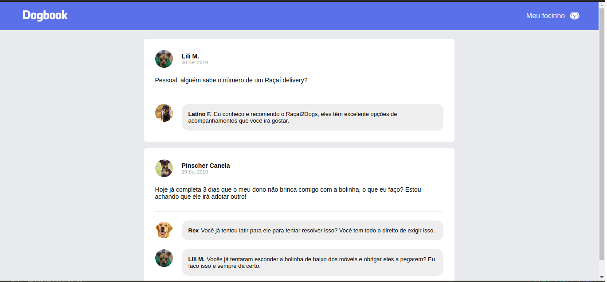

# GoStack Challenge 04
> Objective: Create a simple application (Dogbook) using ReactJS with a graphical user interface similar to Facebook. The information on the page is static and does not use REST API or backend. [See full requirements](https://github.com/Rocketseat/bootcamp-gostack-desafio-04")

Used tools:
- ReactJS;
- Webpack;
- Babel;
- Webpack Dev Server;

## Application
The Dogbook is an simple page similar to Facebook using ReactJS components to represent the header, post list, post and comments.

